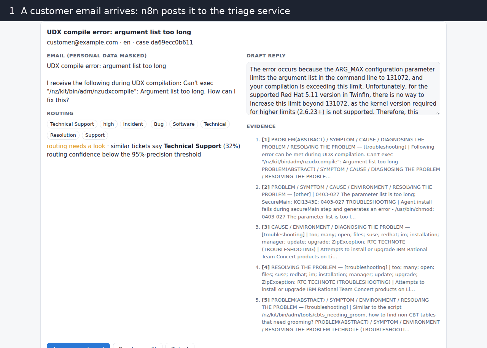
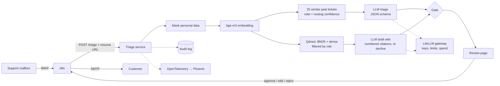
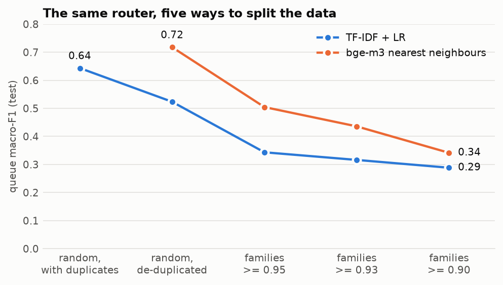
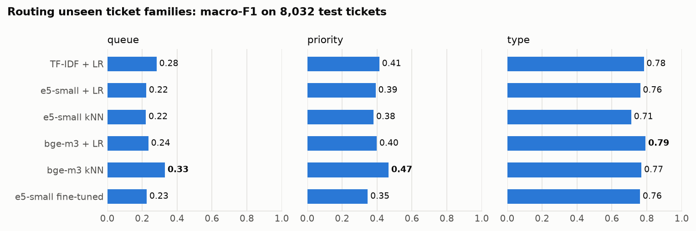
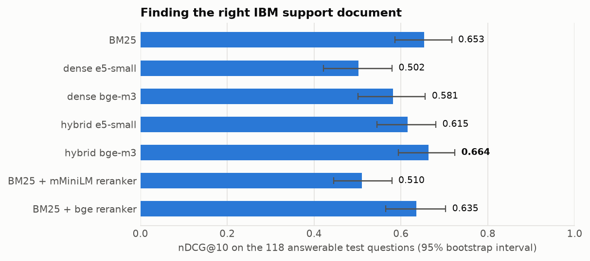

# first-reply

[](https://github.com/GBR-RL/first-reply/actions/workflows/ci.yml)
[](https://github.com/GBR-RL/first-reply/actions/workflows/stack.yml)

Service-desk triage with local LLMs. A support email (German or English) comes in through n8n,
is routed to a queue with a priority and type, answered from a support knowledge base with cited
sources, and held for a person to approve. Nothing reaches a customer without that approval.

Everything runs on CPU with open-weight models (Qwen3.5-4B, Granite 4.2 3B on llama.cpp) behind a
LiteLLM gateway. No hosted model APIs.



## What it does



- **Routing.** The 25 most similar past tickets vote on queue, priority and type; the vote's
  weight is the confidence. The LLM fills a fixed JSON schema with the five closest tickets as
  examples. Routing is applied automatically only when the vote clears a threshold chosen on dev
  for 95% precision *and* the LLM agrees.
- **Answering.** Hybrid search (BM25 + bge-m3, fused with reciprocal rank fusion) over 4,066 IBM
  support documents, filtered inside the search by the caller's role. The model writes a reply
  that cites excerpt numbers, or declines when the excerpts don't contain the answer.
- **Review.** The reviewer sees the email (personal data masked), the routing, the draft and the
  excerpts it cites, and approves, edits or rejects. Each email runs as its own n8n execution
  that waits for that decision and then sends the reply. Every proposal and decision is logged.
- **Operations.** All model calls go through the LiteLLM gateway (aliases, fallback to Granite,
  per-key rate limits and budgets, spend log). Each pipeline step is a span in Phoenix.

## Results

All numbers come from `docs/results/` and are regenerated by the commands below. Intervals are
95% bootstrap intervals.

### The split decides the score

The ticket set is synthetic, and its generator wrote several rewordings and translations of each
seed ticket. With a random split, 41% of test tickets have a training ticket at cosine
similarity >= 0.95 (bge-m3), and 99% of those share the queue label. A nearest-neighbour router
then mostly looks up the twin. Tickets are grouped into paraphrase families (pairs down to 0.90
are still paraphrases or translations) and the split keeps each family on one side.

<picture>
  <source media="(prefers-color-scheme: dark)" srcset="docs/assets/leakage-dark.png">
  
</picture>

Exact duplicates alone add 12 points; paraphrase families add another 24 for TF-IDF and 38 for
the nearest-neighbour router. Everything below uses the family split. Separately, a quarter of
the tickets labelled German are written in English, so language is detected from the text.

### Routing unseen ticket families

<picture>
  <source media="(prefers-color-scheme: dark)" srcset="docs/assets/routing-dark.png">
  
</picture>

Ticket type is learnable from the text (0.79). Queue and priority were mostly memorised per
family: on families never seen in training the best router reaches 0.33 (10 queues) and 0.47
(3 priorities). Fine-tuning multilingual-e5-small with one head per target (2.7 h on a CPU runner)
does not beat TF-IDF.

LLM triage on the same 1,000 test tickets:

| router | queue | priority | type | tags (micro-F1) | time per ticket |
|---|---:|---:|---:|---:|---:|
| Qwen3.5-4B, zero-shot | 0.192 | 0.359 | 0.483 | 0.382 | 13 s |
| Granite 4.2 3B, zero-shot | 0.211 | 0.339 | 0.424 | 0.411 | 9 s |
| Qwen3.5-4B + 5 similar tickets | 0.327 | 0.421 | 0.767 | 0.586 | 35 s |
| bge-m3 nearest neighbours | **0.340** | **0.470** | **0.795** | | 0.4 ms |
| TF-IDF + logistic regression | 0.297 | 0.394 | 0.767 | | 0.1 ms |

Zero-shot, the models don't know the dataset's label conventions (its "Problem" and "Incident"
don't follow the ITIL definitions in the prompt). With retrieved examples they mostly repeat the
examples. For routing labels the LLM adds nothing over the neighbour vote; in the service it
contributes the summary, the product and a second opinion for the gate.

**How much can run without a person.** The confidence threshold that gives 95% precision on dev
routes 5-7% of test tickets by queue (test precision 0.90-0.94: thresholds carry over imperfectly
to unseen families), almost none by priority, and about half by type. The service's gate (vote
confidence and LLM agreement) covers 7.0% of queue decisions at 82.9% precision. On this data,
queue routing stays a human decision, and the gate says so.

### Retrieval

<picture>
  <source media="(prefers-color-scheme: dark)" srcset="docs/assets/retrieval-dark.png">
  
</picture>

TechQA questions are full of product names and error codes, so BM25 alone beats both dense
models; fusing it with bge-m3 is best (0.688 on the 662 train and dev questions used to choose
the setup, 0.664 on test). Cross-encoder rerankers make results worse here and cost up to 37 s
per query on CPU. Section-aware chunking and fixed windows are within noise of each other.

German questions (the English questions machine-translated) against the English documents,
nDCG@10 on 662 questions:

| method | English | German |
|---|---:|---:|
| BM25 | 0.638 | 0.563 |
| dense bge-m3 | 0.642 | 0.625 |
| hybrid bge-m3 | 0.688 | 0.646 |

**Access control.** APAR defect records are visible to support engineers, security bulletins to
the security team, the rest to everyone (a policy assigned for testing; TechQA has no access
metadata). Across 780 questions and three roles, **no restricted chunk was ever returned**. A
customer can reach a relevant document for 78% of questions; the rest have to be handed over.

### Drafting and faithfulness

All 885 questions, five excerpts from hybrid search:

| | Qwen3.5-4B | Granite 4.2 3B |
|---|---:|---:|
| answered when a relevant document was shown | 81.5% | 95.1% |
| declined when none was shown | **59.5%** | 27.1% |
| answered questions the knowledge base cannot answer | **35.2%** | 66.7% |
| answers citing a relevant document | **71.3%** | 60.9% |
| judged fully supported by the excerpts (floor) | 22.7% [19.4, 26.2] | 24.7% [21.8, 28.1] |
| corrected faithfulness | 0.98 [0.70, 1.00] | 1.00 [0.78, 1.00] |
| time per draft (4-vCPU runner) | 94 s | 75 s |

The faithfulness judge (Qwen3.5-4B) was first checked against RAGBench's GPT-4 support labels on
300 responses: it almost never passes an unsupported reply (false-pass rate 2.2%) but fails most
supported ones (77%), Cohen's kappa 0.21. Its pass rate is therefore a floor; the corrected range
applies the measured error rates (Rogan-Gladen) and is wide because the judge's sensitivity is
low. On the answers they give, both models stay close to their excerpts. The difference is
*when* they answer: Granite answers two thirds of the questions the knowledge base can't answer.
The service uses Qwen.

### Cost on CPU

On a 4-vCPU runner, one ticket costs about 2,300 prompt and 125 output tokens for the draft plus
1,200 and 90 for few-shot triage: roughly two minutes, almost all of it prompt processing. The
gateway's internal chargeback rate (a unit for budgets, not a vendor price) puts 1,000 tickets
at about 0.43.

## Run it

Python 3.11, [uv](https://docs.astral.sh/uv/), and for the service a llama.cpp server.

```bash
uv venv && uv pip install -e ".[dev,service,ml,gateway]"
uv pip install torch --index-url https://download.pytorch.org/whl/cpu

first-reply data          # download (pinned, checksummed), de-duplicate, split by family
first-reply kb-chunks     # cut the knowledge base into chunks
first-reply data-card     # docs/data.md

first-reply route --method tfidf_lr        # routing baselines
first-reply leakage-check                  # the five splits
first-reply charts                         # README charts from docs/results
first-reply embed --model bge-m3 --corpus tickets   # slow on CPU: see the Embeddings workflow
first-reply retrieval-eval --mode hybrid --model bge-m3
```

The slow runs are GitHub Actions workflows on free CPU runners, split into parallel shards:
`Embeddings` (bge-m3 vectors), `Routing run` (the fine-tune), `LLM run` (triage, drafting,
translation, judging; each shard runs llama.cpp behind the gateway). `first-reply reports`
rebuilds every results file from their outputs.

**The whole stack.** Prepare the data and the embedding cache, put a GGUF model at
`models/model.gguf` (`first-reply model-url qwen3.5-4b`), then:

```bash
docker compose up --build --wait
python -m first_reply.service.smoke    # email in, approval, reply out
```

Review page: http://localhost:8000/review, n8n: http://localhost:5678, traces:
http://localhost:6006, test mailboxes: GreenMail on ports 3025 (SMTP) and 3143 (IMAP). The
`Stack` workflow runs exactly this on every change to the service.

## Layout

```
src/first_reply/
  data/       downloads, ticket cleaning, paraphrase families, TechQA corpus, data card
  routing/    TF-IDF, embedding and kNN routers, fine-tuned encoder, leakage check
  kb/         chunking, BM25 sparse vectors, Qdrant index, retrieval, reranking, access tiers
  llm/        gateway client, triage schema, grounded drafting, faithfulness judge
  eval/       metrics, sharded LLM runs, reports, charts
  service/    pipeline, FastAPI app, review page, audit log, PII masking, smoke test, demo
gateway/      LiteLLM configuration
workflows/    n8n workflows (inbox, one case per email) and demo mailbox credentials
docs/         data card, results, charts
```

## Data and licences

- Tickets: [Tobi-Bueck/customer-support-tickets](https://huggingface.co/datasets/Tobi-Bueck/customer-support-tickets),
  CC BY-NC 4.0, synthetic. Used for routing only; its answers are generic templates.
- Knowledge base and questions: TechQA from [RAGBench](https://huggingface.co/datasets/galileo-ai/ragbench),
  CC BY 4.0. Relevance and support labels come from GPT-4, not people.
- Models: Qwen3.5-4B and Granite 4.2 3B (Apache 2.0), bge-m3 and multilingual-e5-small (MIT).

Details, counts and caveats are in [docs/data.md](docs/data.md). Code: MIT.

## Limitations

- The tickets are synthetic and their queue and priority labels are only loosely tied to the
  text; routing numbers say more about this dataset than about a real service desk.
- Relevance labels cover each question's own five candidate documents; a relevant document
  elsewhere in the corpus counts as a miss.
- The German questions are machine translations, not questions written in German.
- The judge is the same model as the main drafter. Its validation on RAGBench bounds how far its
  verdicts can be trusted, but not every bias.
- The access policy is assigned from document types to exercise the filter, not taken from a
  real system.
